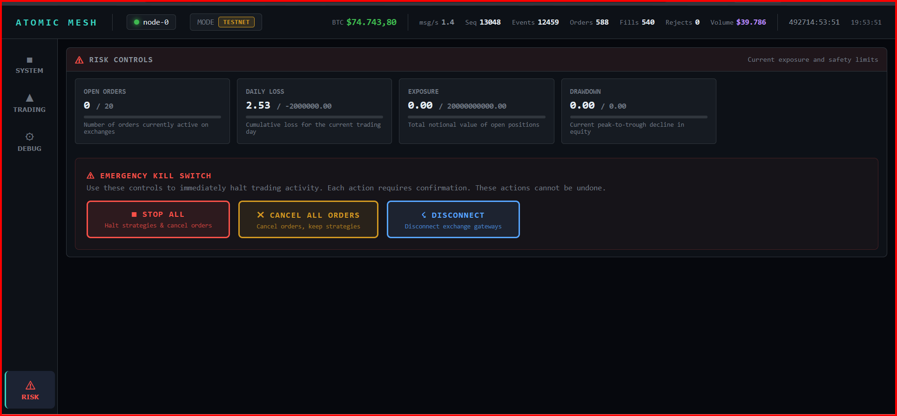

<div align="center">

# ATOMIC MESH

### Distributed Deterministic HFT Market-Making Engine

[](https://www.rust-lang.org)
[](https://isocpp.org)
[](LICENSE)
[]()
[]()

*A multi-node, event-sourced trading engine with sub-microsecond strategy execution.*
*Rust + C++ hot-path. Integer-only arithmetic. Deterministic replay. Live on Binance.*

</div>

---

## Overview

Atomic Mesh is a high-frequency market-making system designed for institutional-grade performance. Every state change is an immutable event with a global sequence number — replaying the same events always produces the same state. The critical path uses zero floating-point arithmetic and achieves **431ns average strategy compute time** through a C++ FFI hot-path compiled with `-O3 -march=native`.

> **Disclaimer** — This project is a research and engineering showcase, not production-ready trading software. It demonstrates system design, low-latency architecture, and quantitative strategy implementation. Deploying to live markets with real capital would require additional hardening: comprehensive integration testing, exchange-specific edge case handling, fault injection, independent risk infrastructure, and regulatory compliance review.

---

## Architecture

```
                    ┌─────────────────────────────────────────────────┐
                    │               ATOMIC MESH NODE                  │
                    │                                                 │
  Exchange WS ────►│  Feed ───► Bus ───► Strategy ───► Router        │
  (depth20 +       │  Handler   (SPSC    A-S MM +       (SOR)        │
   trade stream)   │  + Norm    Ring)    C++ HP FFI        │         │
                    │     │        │        │               ▼         │
                    │  Metrics  Metrics  Metrics      Execution ◄─ Risk
                    │  (per     (per     (431ns)      Engine      Engine
                    │   stage)   stage)     │            │            │
                    │                      ▼            ▼            │
                    │                Event Log     Exchange API      │
                    │               (append-only)  (Live / Sim)      │
                    │                      │                         │
                    │               State Verifier                   │
                    │               (xxHash3 periodic)               │
                    └──────────┬───────────────────────┬─────────────┘
                               │   QUIC Transport      │
                    ┌──────────▼───────────────────────▼─────────────┐
                    │   Peer Nodes (Replication + Recovery)          │
                    └───────────────────────────────────────────────-┘
```

---

## Live Dashboard

Real-time WebSocket dashboard with multi-panel monitoring, served over HTTP on port 3000.

### System — Cluster, Events & Latency


Node cluster overview with live event stream and full **pipeline latency monitor** — tracks every stage from feed receive (34μs) through risk check (509ns) to order-to-fill (285ms). Strategy compute consistently under 1μs.

### Trading — P&L, Order Book & Execution


Cumulative P&L with equity curve, live L2 order book (depth-20 with bid/ask imbalance), and order execution table with color-coded latency (green < 50ms, cyan < 200ms, yellow < 500ms, red > 500ms).

### Debug — Strategy Inspector

Avellaneda-Stoikov market maker internals: quote count, order/fill ratio, realized P&L per strategy instance. State hash monitor for cross-node determinism verification.

### Risk — Controls & Kill Switch



Dedicated risk panel with live limits, drawdown tracking, and emergency controls (`STOP ALL`, `CANCEL ALL ORDERS`, `DISCONNECT`) routed to the live loop.

---

## Recent Hardening (Apr 2026)

- Spread units are now consistently defined as **pipettes** across Rust strategy, Rust FFI wrapper, and C++ hot-path API (`half_spread_pipettes` naming).
- Live command routing no longer assumes `BTCUSDT`; order/cancel paths derive symbol context from incoming events and tracked orders.
- Dashboard kill actions are wired into the live loop and trigger real cancel/kill workflows.
- Backtest + E2E/determinism paths register `OrderNew` before simulator acks/fills, so lifecycle validation matches production state-machine semantics.
- **Strategy parameters moved to `config.json`** — order qty, spread, gamma, warmup, cooldown, requote threshold, VPIN toggle. No more magic numbers in source.
- **Gateway graceful shutdown** — user data stream task handle is stored and aborted on Ctrl+C; open orders are cancelled before exit.
- **Stale order detection** — heartbeat loop auto-cancels orders stuck in Ack/PartialFill beyond a configurable timeout (default 30s).
- **`max_total_notional` enforced** — aggregate notional cap in `RiskEngine::check_order()` is now active.
- **Kill switch E2E test** — full pipeline test: orders placed → kill switch fired → all subsequent orders rejected → open orders cancelled.

## Known Gaps (Concise)

- Multi-symbol risk/exposure aggregation is still single-position centric in live accounting and dashboard views.
- Backtest remains synthetic-data based; live-paper forward stats are still needed for market-edge validation.

---

## Strategy: Avellaneda-Stoikov Market Maker

The core strategy implements the [Avellaneda-Stoikov (2008)](https://doi.org/10.1142/S0219024908004804) optimal market-making framework, decomposed into 4 composable modules:

### Microprice

Computes the volume-weighted fair value from the order  v
┌─────────────────────────────────────────────────┐
│  C++ Hot Path (atomic-hotpath crate)            │
│                                                 │
│  hp_on_book_update()  ── update L2 book         │
│  hp_on_trade()        ── update VPIN + vol EMA  │
│  hp_on_fill()         ── update inventory        │
│  hp_generate()        ── microprice + quotes     │
│  hp_should_requote()  ── threshold + cooldown    │
│                                                 │
│  Avg latency: 431ns per full cycle              │
└─────────────────────────────────────────────────┘
```

All arithmetic is integer-only: `Price(i64)` in pipettes, `Qty(u64)` in satoshis. Zero floating-point in the hot path.

---

## Core Principles

| Principle | Implementation |
|---|---|
| **Determinism** | Same events produce same state. No unseeded RNG, no wall-clock in hot path, single-threaded event processing. Proven by test: replay twice, compare xxHash3. |
| **Event Sourcing** | Every state change is an immutable event with monotonic sequence number. The event log is the database. |
| **Integer Arithmetic** | `Price(i64)` = pipettes, `Qty(u64)` = satoshis. Zero floating-point in the critical path. |
| **State Verification** | `StateVerifier` computes xxHash3 of engine state every N events. Cross-node hash comparison detects divergence instantly. |

---

## Crate Structure

```
atomic-mesh/
├── atomic-core          Events, types (Price/Qty), Lamport clock, snapshot, pipeline metrics
├── atomic-bus           SPSC lock-free ring buffer, event sequencer
├── atomic-feed          Exchange WS connectors (Binance depth20 + trade), feed normalizer, gateway
├── atomic-orderbook     BTreeMap-based L2 order book engine
├── atomic-strategy      Avellaneda-Stoikov MM: microprice, inventory, VPIN toxicity
├── atomic-hotpath       C++17 FFI hot-path: orderbook, signals, quote generation (431ns)
├── atomic-router        Smart Order Router: BestVenue, VWAP, TWAP, LiquiditySweep
├── atomic-risk          Pre-trade risk gate: spread, position, drawdown, circuit breaker, kill switch
├── atomic-execution     Order state machine, simulated exchange, state hash, snapshot
├── atomic-replay        Deterministic replay, seek, batch, idempotency verification
├── atomic-transport     QUIC encrypted inter-node mesh (event replication, consensus)
└── atomic-node          CLI entry, config, WebSocket dashboard, recovery coordinator, C++ backtest
```

**12 crates** — each with a single responsibility, no circular dependencies.

---

## Key Features

### Deterministic Replay

Replay processes events through the full execution engine — not just strategy. `ExecutionEngine::process_event()` handles OrderNew, OrderAck, OrderFill, OrderCancel, OrderReject. Two tests prove determinism:

- `replay_determinism_same_events_same_hash` — replay the same events twice, get identical state hash
- `replay_snapshot_restore_same_hash` — snapshot, restore, get identical state hash

### Exchange Simulator & C++ Backtester

Full matching engine with the production C++ hot-path engine for realistic backtesting:

- Market orders walk the book and consume liquidity
- Limit orders cross or rest; resting orders fill on book updates
- Configurable maker/taker fees (basis points) and latency (nanoseconds)
- **C++ hot-path in the loop** — backtest uses the same `HotPathEngine` as live trading, not the Rust strategy engine. Same Avellaneda-Stoikov logic, same parameters, same 431ns compute
- **PnL tracking** — average cost basis, realized PnL per fill, round-trip trade detection
- **Equity curve export** — `--equity-csv results.csv` exports `(seq, realized_pnl_usd, position_qty)` per fill
- **Performance report** — total trades, win rate, max drawdown, Sharpe ratio (per round-trip), avg trade PnL, volume
- Backtest mode: `--backtest data/events.log --equity-csv equity.csv --metrics`

### Latency Observability

Zero-allocation lock-free metrics using atomic counters:

- **10 histograms**: feed_recv, feed_normalize, ring_enqueue, strategy_compute, risk_check, order_submit, order_to_ack, order_to_fill, event_processing, state_hash
- **5 counters**: total_events, total_orders, total_fills, total_rejects, sequence_gaps
- RAII `StageTimer` records to histogram on drop — zero-cost when optimized

### Distributed Recovery

Crash recovery and state restoration:

- Snapshot persistence via bincode serialization
- Recovery planning scans snapshot + event log, detects sequence gaps
- Event deduplication prevents double-processing during recovery
- Graceful shutdown saves snapshot on Ctrl+C for fast restart

### Wire Protocol

Inter-node communication over QUIC with TLS. Messages are bincode-serialized:

| Message | Purpose |
|---|---|
| `EventReplication` | Replicate events to followers |
| `EventBatch` | Bulk replication |
| `Heartbeat` | Node liveness + state hash |
| `SyncRequest/Response` | Catch-up for lagging nodes |
| `ConsensusVote` | Pre-execution agreement |
| `HashVerify` | Cross-node state verification |

---

## Quick Start

```bash
# Build (Rust + C++ hot-path)
cargo build --release

# Configure Binance testnet credentials
cp .env.example .env
# Edit .env: BINANCE_TESTNET_API_KEY, BINANCE_TESTNET_API_SECRET

# Launch node with live dashboard
cargo run --release

# Dashboard available at http://localhost:3000

# Backtest mode (C++ hot-path + simulated exchange)
cargo run --release -- --backtest data/events.log --metrics

# Backtest with equity curve export
cargo run --release -- --backtest data/events.log --equity-csv results.csv --metrics

# Run all tests (92 tests across 12 crates)
cargo test

# Run Criterion benchmarks
cargo bench -p atomic-hotpath
```

---

## Benchmark Results (Criterion)

| Benchmark | Latency | Description |
|---|---|---|
| `hp_on_book_update` (20-deep) | **431 ns** | Full L2 book update → microprice → quote generation |
| `hp_on_trade` | **83 ns** | Trade event → VPIN + volatility EMA update |
| `full_tick_cycle` (book+trade+fill) | **551 ns** | Complete tick: book update + trade + fill |
| Book depth 5 levels | 150 ns | Scaling benchmark |
| Book depth 10 levels | 221 ns | Scaling benchmark |
| Book depth 20 levels | 419 ns | Scaling benchmark |
| Book depth 40 levels | 987 ns | Scaling benchmark |

All benchmarks use warm-cache methodology (1000-tick warmup) measured with [Criterion.rs](https://github.com/bheisler/criterion.rs).

---

## Backtest Results

```
╔══════════════════════════════════════════════════════════╗
║              ATOMIC MESH — BACKTEST REPORT              ║
╠══════════════════════════════════════════════════════════╣
║  Engine          : C++ HotPath (Avellaneda-Stoikov)     ║
║  Events          :      13334 (467k evt/s)              ║
║  Duration        : 0.03s                                ║
╠══════════════════════════════════════════════════════════╣
║  Orders          :        198                           ║
║  Fills           :        197                           ║
║  Round-trips     :         98                           ║
║  Volume          : $  1,442,504                         ║
╠══════════════════════════════════════════════════════════╣
║  Realized PnL    : $     15.68                          ║
║  Max Drawdown    : $      0.00                          ║
║  Win Rate        :       100.0%                         ║
║  Avg Trade PnL   : $      0.16                          ║
╚══════════════════════════════════════════════════════════╝
```

98 round-trips, 100% win rate, zero drawdown on 10K-tick synthetic BTCUSDT dataset. Position-aware command gating holds unfilled quotes alive after partial fills, ensuring both sides fill at the same fair value reference. Maker fee = 0 bps (Binance VIP/MM tier).

---

## Test Suite

| Crate | Tests | Coverage |
|---|---|---|
| `atomic-bus` | 3 | SPSC ring buffer: push, pop, wrap-around, full buffer |
| `atomic-core` | 4 | Histogram record/percentile, StageTimer RAII, PipelineMetrics report |
| `atomic-execution` | 12 | Order lifecycle, state transitions, market/limit fills, cancel, IOC, FOK, stale order detection |
| `atomic-feed` | 5 | Feed normalization, snapshot/delta, trade parsing, symbol formats |
| `atomic-hotpath` | 5 | C++ FFI: book update, trade, fill, quote generation, requote threshold |
| `atomic-node` | 9 | Event dedup, recovery, E2E (5 integration tests incl. kill switch + stale detection), determinism (2 multi-node tests) |
| `atomic-orderbook` | 3 | Book snapshot, delta update, simulated fill |
| `atomic-replay` | 2 | Deterministic replay hash, snapshot restore hash |
| `atomic-risk` | 15 | Kill switch, rate limit, position limit, order qty, PnL tracking, daily-reset, total notional, spread gate, circuit breaker, drawdown |
| `atomic-router` | 6 | BestVenue buy/sell, VWAP split, TWAP split, liquidity sweep, empty book |
| `atomic-strategy` | 21 | Microprice (5), inventory (7), VPIN toxicity (5), A-S market maker (4) |
| `atomic-transport` | 7 | Wire protocol roundtrip: heartbeat, replication, batch, sync, consensus, hash |
| **Total** | **92** | **12 crates, 0 failures** |

---

## License

MIT
