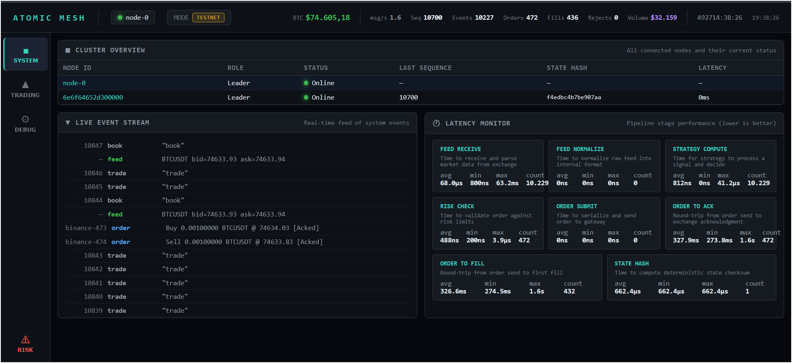
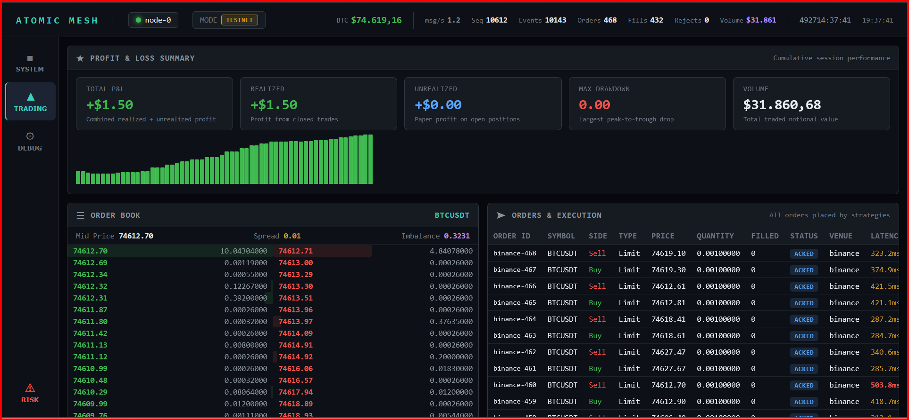
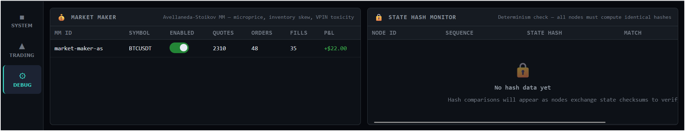

<div align="center">

# ATOMIC MESH

### Distributed Deterministic HFT Market-Making Engine

[](https://www.rust-lang.org)
[](https://isocpp.org)
[](LICENSE)
[]()
[]()

*A multi-node, event-sourced trading engine with sub-microsecond strategy execution.*
*Rust + C++ hot-path. Integer-only arithmetic. Deterministic replay. Live on Binance.*

</div>

---

## Overview

Atomic Mesh is a high-frequency market-making system designed for institutional-grade performance. Every state change is an immutable event with a global sequence number — replaying the same events always produces the same state. The critical path uses zero floating-point arithmetic and achieves **575ns average strategy compute time** through a C++ FFI hot-path compiled with `-O3 -march=native`.

> **Disclaimer** — This project is a research and engineering showcase, not production-ready trading software. It demonstrates system design, low-latency architecture, and quantitative strategy implementation. Deploying to live markets with real capital would require additional hardening: comprehensive integration testing, exchange-specific edge case handling, fault injection, independent risk infrastructure, and regulatory compliance review.

---

## Architecture

```
                    ┌─────────────────────────────────────────────────┐
                    │               ATOMIC MESH NODE                  │
                    │                                                 │
  Exchange WS ────►│  Feed ───► Bus ───► Strategy ───► Router        │
  (depth20 +       │  Handler   (SPSC    A-S MM +       (SOR)        │
   trade stream)   │  + Norm    Ring)    C++ HP FFI        │         │
                    │     │        │        │               ▼         │
                    │  Metrics  Metrics  Metrics      Execution ◄─ Risk
                    │  (per     (per     (575ns)      Engine      Engine
                    │   stage)   stage)     │            │            │
                    │                      ▼            ▼            │
                    │                Event Log     Exchange API      │
                    │               (append-only)  (Live / Sim)      │
                    │                      │                         │
                    │               State Verifier                   │
                    │               (xxHash3 periodic)               │
                    └──────────┬───────────────────────┬─────────────┘
                               │   QUIC Transport      │
                    ┌──────────▼───────────────────────▼─────────────┐
                    │   Peer Nodes (Replication + Recovery)          │
                    └───────────────────────────────────────────────-┘
```

---

## Live Dashboard

Real-time WebSocket dashboard with multi-panel monitoring, served over HTTP on port 3000.

### System — Cluster, Events & Latency



Node cluster overview with live event stream and full **pipeline latency monitor** — tracks every stage from feed receive (34μs) through risk check (509ns) to order-to-fill (285ms). Strategy compute consistently under 1μs.

### Trading — P&L, Order Book & Execution



Cumulative P&L with equity curve, live L2 order book (depth-20 with bid/ask imbalance), and order execution table with color-coded latency (green < 50ms, cyan < 200ms, yellow < 500ms, red > 500ms).

### Debug — Strategy Inspector



Avellaneda-Stoikov market maker internals: quote count, order/fill ratio, realized P&L per strategy instance. State hash monitor for cross-node determinism verification.

---

## Strategy: Avellaneda-Stoikov Market Maker

The core strategy implements the [Avellaneda-Stoikov (2008)](https://doi.org/10.1142/S0219024908004804) optimal market-making framework, decomposed into 4 composable modules:

### Microprice

Computes the volume-weighted fair value from the order book — not the naive midpoint:

```
microprice = (ask × bid_vol + bid × ask_vol) / (bid_vol + ask_vol)
```

Uses multi-level depth weighting with linearly decreasing weights across the top N levels. Computes book imbalance as `(bid_vol − ask_vol) / total` scaled to basis points. The microprice predicts the next trade direction better than the midpoint because it reflects where pending supply and demand actually sit.

### Inventory Skew

Avellaneda-Stoikov inventory skew — the MM quotes asymmetrically based on its position to control risk:

```
skew = γ × (position / max_position) × half_spread
```

When long, the ask is lowered to sell faster. When flat, quotes are symmetric. Position is clamped at zero on spot exchanges — the MM never enters a short position. Sell quantity is capped to actual holdings.

### Toxicity Detection (VPIN)

VPIN-lite (Volume-Synchronized Probability of Informed Trading) detects adverse selection in real time:

```
VPIN = |buy_vol − sell_vol| / total_vol    (rolling 200-tick window)
```

Rolling trade window measures buy/sell volume imbalance. Volatility EMA tracks `|Δprice|` for dynamic spread adjustment. A spread multiplier (1.0× – 3.0×) combines toxicity and volatility to widen spread under stress. When flow turns toxic, all quotes are pulled immediately via CancelAll.

### Quote Engine

Orchestrates all modules into a continuous quoting loop:

```
bid = microprice − half_spread × toxicity_mult − inventory_skew
ask = microprice + half_spread × toxicity_mult − inventory_skew
```

On **book update**: recompute microprice, requote if fair value moved beyond threshold. On **trade**: feed toxicity tracker, pull quotes if VPIN spikes. On **fill**: update inventory, reset cooldown for immediate requote. Configurable warmup period (K book updates) and cooldown (N ticks between requotes).

---

## Pre-Trade Risk Gate

Three-tier risk hierarchy designed for market-making — rejects toxic orders before they leave the node:

### Tier 1 — Per-Order Gate (microsecond)

Every order passes through `check_order()` before routing to execution:

| Check | What it does |
|---|---|
| **Spread gate** | Rejects quoting when `spread > max_spread`. Protects against adverse selection during flash crashes, halts, and illiquid conditions. Fed by live book spread on every tick. |
| **Max order qty** | Single order cannot exceed configured size |
| **Position limit** | Resulting position cannot exceed `max_position_qty` |
| **Notional cap** | Exposure cannot exceed `max_notional` per symbol |
| **Open orders** | Cannot exceed `max_open_orders` simultaneously |
| **Rate limiter** | Max `max_orders_per_second` to avoid exchange bans |

### Tier 2 — Circuit Breaker (soft pause)

Automatically pauses quoting on adverse patterns. Resets at UTC midnight via `daily_reset()`:

| Trigger | Behavior |
|---|---|
| **Consecutive losses** | After N losing round-trips in a row → circuit breaker fires. A round-trip = position goes flat. Resets on first winning trade or daily reset. |
| **Drawdown from peak** | When `(peak_pnl − current_pnl) / peak_pnl > max_drawdown_bps` → soft pause. Prevents giving back a winning session. |

### Tier 3 — Kill Switch (hard stop)

Global atomic boolean. Once fired, **all orders are rejected** until manual `reset_kill_switch()`:

- Triggers when `total_pnl < max_loss` (absolute loss limit)
- Only human override can restart — not automated

### Daily Reset

On UTC midnight (detected via heartbeat tick every 5s):
- Circuit breaker cleared
- Consecutive losses reset
- PnL, volume, cost basis zeroed
- New trading session starts clean

---

## C++ Hot-Path (FFI)

The performance-critical path — orderbook maintenance, microprice, signal computation, and quote generation — is implemented in C++17 and called via FFI through Rust's `cc` crate. Compiled with `-O3 -march=native` for native SIMD and branch prediction optimization.

```
┌─────────────────────────────────────────────────┐
│  C++ Hot Path (atomic-hotpath crate)            │
│                                                 │
│  hp_on_book_update()  ── update L2 book         │
│  hp_on_trade()        ── update VPIN + vol EMA  │
│  hp_on_fill()         ── update inventory        │
│  hp_generate()        ── microprice + quotes     │
│  hp_should_requote()  ── threshold + cooldown    │
│                                                 │
│  Avg latency: 575ns per full cycle              │
└─────────────────────────────────────────────────┘
```

All arithmetic is integer-only: `Price(i64)` in pipettes, `Qty(u64)` in satoshis. Zero floating-point in the hot path.

---

## Core Principles

| Principle | Implementation |
|---|---|
| **Determinism** | Same events produce same state. No unseeded RNG, no wall-clock in hot path, single-threaded event processing. Proven by test: replay twice, compare xxHash3. |
| **Event Sourcing** | Every state change is an immutable event with monotonic sequence number. The event log is the database. |
| **Integer Arithmetic** | `Price(i64)` = pipettes, `Qty(u64)` = satoshis. Zero floating-point in the critical path. |
| **State Verification** | `StateVerifier` computes xxHash3 of engine state every N events. Cross-node hash comparison detects divergence instantly. |

---

## Crate Structure

```
atomic-mesh/
├── atomic-core          Events, types (Price/Qty), Lamport clock, snapshot, pipeline metrics
├── atomic-bus           SPSC lock-free ring buffer, event sequencer
├── atomic-feed          Exchange WS connectors (Binance depth20 + trade), feed normalizer, gateway
├── atomic-orderbook     BTreeMap-based L2 order book engine
├── atomic-strategy      Avellaneda-Stoikov MM: microprice, inventory, VPIN toxicity
├── atomic-hotpath       C++17 FFI hot-path: orderbook, signals, quote generation (575ns)
├── atomic-router        Smart Order Router: BestVenue, VWAP, TWAP, LiquiditySweep
├── atomic-risk          Pre-trade risk gate: spread, position, drawdown, circuit breaker, kill switch
├── atomic-execution     Order state machine, simulated exchange, state hash, snapshot
├── atomic-replay        Deterministic replay, seek, batch, idempotency verification
├── atomic-transport     QUIC encrypted inter-node mesh (event replication, consensus)
└── atomic-node          CLI entry, config, WebSocket dashboard, recovery coordinator, C++ backtest
```

**12 crates** — each with a single responsibility, no circular dependencies.

---

## Key Features

### Deterministic Replay

Replay processes events through the full execution engine — not just strategy. `ExecutionEngine::process_event()` handles OrderNew, OrderAck, OrderFill, OrderCancel, OrderReject. Two tests prove determinism:

- `replay_determinism_same_events_same_hash` — replay the same events twice, get identical state hash
- `replay_snapshot_restore_same_hash` — snapshot, restore, get identical state hash

### Exchange Simulator & C++ Backtester

Full matching engine with the production C++ hot-path engine for realistic backtesting:

- Market orders walk the book and consume liquidity
- Limit orders cross or rest; resting orders fill on book updates
- Configurable maker/taker fees (basis points) and latency (nanoseconds)
- **C++ hot-path in the loop** — backtest uses the same `HotPathEngine` as live trading, not the Rust strategy engine. Same Avellaneda-Stoikov logic, same parameters, same 575ns compute
- **PnL tracking** — average cost basis, realized PnL per fill, round-trip trade detection
- **Equity curve export** — `--equity-csv results.csv` exports `(seq, realized_pnl_usd, position_qty)` per fill
- **Performance report** — total trades, win rate, max drawdown, Sharpe ratio (per round-trip), avg trade PnL, volume
- Backtest mode: `--backtest data/events.log --equity-csv equity.csv --metrics`

### Latency Observability

Zero-allocation lock-free metrics using atomic counters:

- **10 histograms**: feed_recv, feed_normalize, ring_enqueue, strategy_compute, risk_check, order_submit, order_to_ack, order_to_fill, event_processing, state_hash
- **5 counters**: total_events, total_orders, total_fills, total_rejects, sequence_gaps
- RAII `StageTimer` records to histogram on drop — zero-cost when optimized

### Distributed Recovery

Crash recovery and state restoration:

- Snapshot persistence via bincode serialization
- Recovery planning scans snapshot + event log, detects sequence gaps
- Event deduplication prevents double-processing during recovery
- Graceful shutdown saves snapshot on Ctrl+C for fast restart

### Wire Protocol

Inter-node communication over QUIC with TLS. Messages are bincode-serialized:

| Message | Purpose |
|---|---|
| `EventReplication` | Replicate events to followers |
| `EventBatch` | Bulk replication |
| `Heartbeat` | Node liveness + state hash |
| `SyncRequest/Response` | Catch-up for lagging nodes |
| `ConsensusVote` | Pre-execution agreement |
| `HashVerify` | Cross-node state verification |

---

## Quick Start

```bash
# Build (Rust + C++ hot-path)
cargo build --release

# Configure Binance testnet credentials
cp .env.example .env
# Edit .env: BINANCE_TESTNET_API_KEY, BINANCE_TESTNET_API_SECRET

# Launch node with live dashboard
cargo run --release

# Dashboard available at http://localhost:3000

# Backtest mode (C++ hot-path + simulated exchange)
cargo run --release -- --backtest data/events.log --metrics

# Backtest with equity curve export
cargo run --release -- --backtest data/events.log --equity-csv results.csv --metrics

# Run all tests (46 tests across 7 crates)
cargo test
```

---

## Test Suite

| Crate | Tests | Coverage |
|---|---|---|
| `atomic-bus` | 3 | SPSC ring buffer: push, pop, wrap-around, full buffer |
| `atomic-core` | 4 | Histogram record/percentile, StageTimer RAII, PipelineMetrics report |
| `atomic-execution` | 11 | Order lifecycle, state transitions, market/limit fills, cancel, IOC, FOK |
| `atomic-feed` | 5 | Feed normalization, snapshot/delta, trade parsing, symbol formats |
| `atomic-hotpath` | 5 | C++ FFI: book update, trade, fill, quote generation, requote threshold |
| `atomic-node` | 2 | Event deduplicator, recovery cold start |
| `atomic-orderbook` | 3 | Book snapshot, delta update, simulated fill |
| `atomic-replay` | 2 | Deterministic replay hash, snapshot restore hash |
| `atomic-risk` | 10 | Kill switch, rate limit, position limit, order qty, PnL tracking, reset |
| `atomic-router` | 6 | BestVenue buy/sell, VWAP split, TWAP split, liquidity sweep, empty book |
| `atomic-strategy` | 21 | Microprice (5), inventory (7), VPIN toxicity (5), A-S market maker (4) |
| `atomic-transport` | 7 | Wire protocol roundtrip: heartbeat, replication, batch, sync, consensus, hash |
| **Total** | **79** | |

---

## License

MIT
